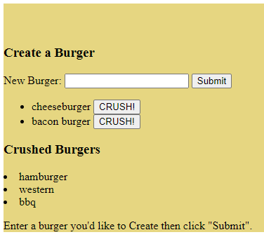

# burgerzz

## Table of Contents
* [Description](#description)
* [Installation Instructions](#installation)
* [Usage Information](#usage)
* [Contributors](#contributor)
* [Tests](#tests)
* [License](#license)
* [Questions](#questions)

## URL

https://desolate-badlands-73046.herokuapp.com/

## Description
This app allows the user to create a burger and then eat it digitally.

## Installation Instructions
None

## Usage Information
Free to use.

## Contributors
Layne D. Hansen

## Tests 
No.

## License
MIT_license
  
 

## Questions

For questions and comments, contact me at:

Github: [LayneHansen](https://github.com/LayneHansen)

Email: laynehansen.dev@gmail.com